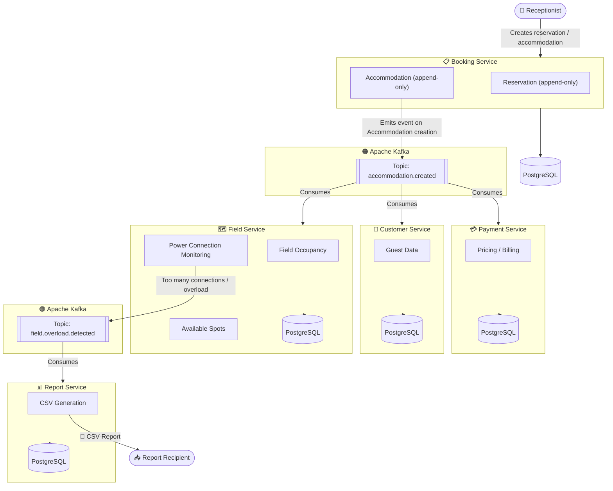

# 🏕️ CampsiteV2

A microservices application for campsite management — handling reservations, billing, field occupancy monitoring, and reporting. Built on Spring Boot, Kafka, and PostgreSQL, deployed on Kubernetes (Rancher Desktop) via ArgoCD and GitHub Actions.

---

## 📐 System Architecture



---

## 🧩 Services

### 📋 Booking Service
The main entry point for reception staff. Data is stored using an **append-only model** (Event Sourcing-inspired), which preserves the full history of events on the campsite.

| Table | Description |
|---|---|
| `reservation` | Reservations — arrivals, departures, guest details |
| `accommodation` | Accommodations — type (tent, motorhome, seasonal trailer), sector, number of guests, power connection status |

After a new `Accommodation` record is saved, the service emits an event to the Kafka topic **`accommodation.created`**.

---

### 💳 Payment Service
Consumes events from the `accommodation.created` topic. Calculates the amount due for a stay based on a pricing table stored in its own database, taking into account:
- number of guests,
- accommodation type (tent / motorhome / trailer),
- power connection,
- length of stay.

---

### 👥 Customer Service - in DEVELOPMENT
Consumes events from the `accommodation.created` topic. Stores and updates data about guests currently using the campsite.

---

### 🗺️ Field Service
Consumes events from the `accommodation.created` topic. Tracks in real time:
- current number of people on the field,
- number of available spots,
- number of active power connections per sector.

When an overload is detected (e.g. too many connections in one sector), it emits an event to the **`field.overload.detected`** topic.

---

### 📊 Report Service - in DEVELOPMENT
Consumes events from the `field.overload.detected` topic. Generates **CSV reports** containing:
- sectors with the highest occupancy,
- peak hours / periods of highest power demand,
- infrastructure recommendations (e.g. where additional power boxes would be beneficial).

---

## 🗄️ Databases

Each service has its own **isolated PostgreSQL instance** (*database per service* pattern).

| Service | Database |
|---|---|
| Booking Service | `campsite_booking` |
| Payment Service | `campsite_payment` |
| Customer Service | `campsite_customer` |
| Field Service | `campsite_field` |
| Report Service | `campsite_report` |

---

## 📨 Messaging — Apache Kafka

| Topic | Producer | Consumers |
|---|---|---|
| `accommodation.created` | Booking Service | Payment Service, Customer Service, Field Service |
| `field.overload.detected` | Field Service | Report Service |

---
---

## 🛠️ Tech Stack

| Layer | Technology |
|---|---|
| Backend | Java 21, Spring Boot 4 on Spring B.x |
| Messaging | Apache Kafka |
| Database | PostgreSQL |
| Containerization | Docker |
| Orchestration | Kubernetes (Rancher Desktop) |
| GitOps / CD | ArgoCD |
| CI | GitHub Actions |
| Build | Maven |

---

## 🚀 Local Setup

### Prerequisites
- Java 21+
- Docker & Docker Compose
- Rancher Desktop
- ArgoCD CLI

### Start infrastructure (Kafka + PostgreSQL)

```bash
docker-compose up -d
```

### Run a service

```bash
cd booking-service
mvn spring-boot:run
```

### Deploy to local K8s via ArgoCD

```bash
# Apply the ArgoCD application
kubectl apply -f argocd/campsite-app.yaml

# Check sync status
argocd app get campsitev2
```

---

## 📁 Repository Structure

```
campsitev2/
├── booking-service/
├── payment-service/
├── customer-service/
├── field-service/
├── report-service/
├── k8s/
│   ├── booking/
│   ├── payment/
│   ├── customer/
│   ├── field/
│   └── report/
├── argocd/
├── .github/
│   └── workflows/
└── docker-compose.yml
```

---

## 📌 Architectural Notes

- The **append-only model** in Booking Service preserves a full event history without modifying existing records — naturally supports auditing and debugging.
- Each service is **autonomous** — it owns its own database and communicates exclusively through Kafka (no direct HTTP calls between services in the core flow).
- Report Service operates **asynchronously** — reports are generated reactively in response to overload events, with no need to poll other services.
